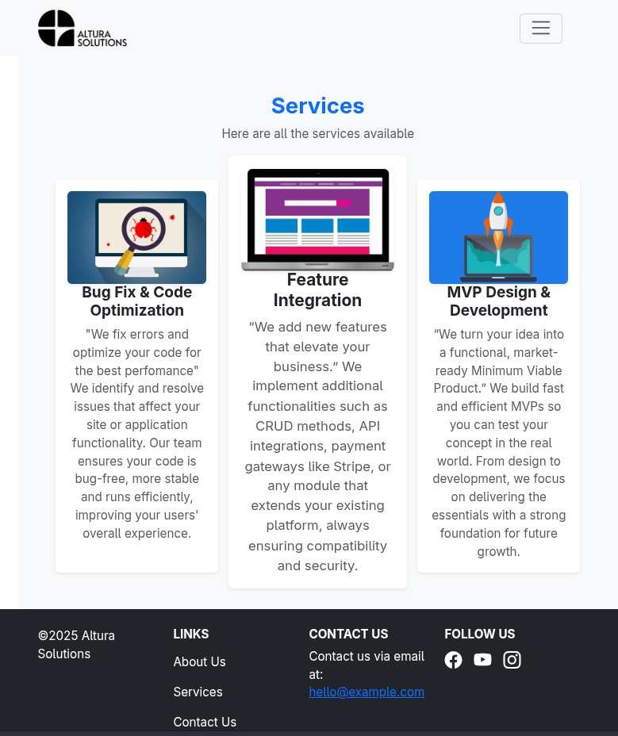
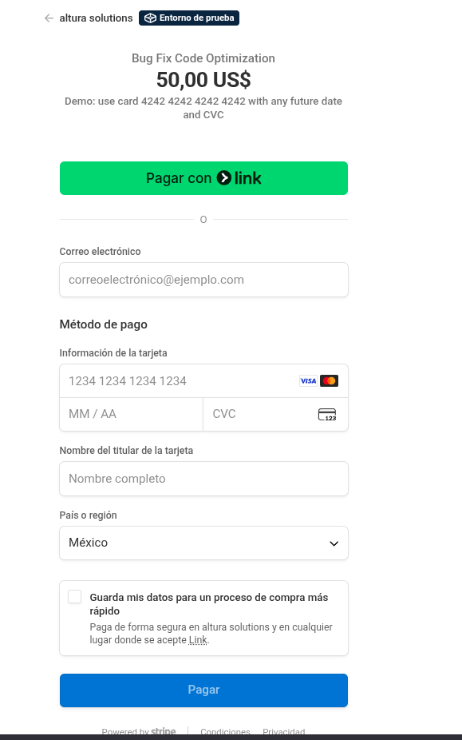

# 🌐 Altura Solutions

Altura Solutions is a fictional **web development agency portal** built with **Django + Wagtail**.  
It serves as a showcase website for a client-focused company specializing in professional web solutions, including a homepage, service listings, about us, contact page, and future payment integration.

---

## 📌 Overview

This project is designed as if it were for a real client, representing a corporate website with the flexibility of a CMS (Wagtail) for easy content management.

---

## Screenshots

---

## ✅ Current Features

- **Homepage** with hero banner, lead text, and call-to-action button.
- **Responsive layout** using Bootstrap 5.
- **Customizable banner** with image overlay and text content.
- **Service models** in Wagtail:
  - `ServiceListingPage` for displaying all services.
  - `ServicePage` for individual service details.
- **Professional service offerings**:
  1. **Bug Fix & Code Optimization** – Fix errors and optimize code for performance.
  2. **Feature Integration & System Expansion** – Add CRUD features, APIs, or payment systems.
  3. **MVP Design & Development** – Build market-ready Minimum Viable Products.
- **About Us** page with company history, mission, and team members.
- **Contact Page** with functional email form.
- **Testimonials** section with client feedback.
- **Service Listing Page** with dynamic cards from Wagtail.
- **Payment Integration** (Stripe) for online service purchases.

---

## 🛠 Planned Features

- **Blog/Insights section** for articles and case studies.
- **SEO optimization** for all pages.
- **Responsive improvements** for mobile and tablet.
- **Custom error pages** (404, 500).

---

## 🧑‍💻 Tech Stack

- **Backend:** Django 5.x, Wagtail CMS
- **Frontend:** Bootstrap 5, custom CSS
- **Database:** PostgreSQL
- **Payment Gateway:** Stripe
- **Deployment:** DigitalOcean

---
